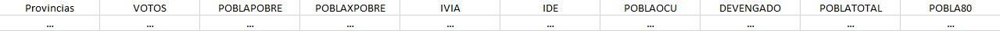

PONTIFICIA UNIVERSIDAD CATÓLICA DEL PERÚ

PROYECTO GRUPAL

CURSO: Estadística para el Análisis Político 2 (POL304-0689C)
PROFESOR: José Manuel Magallanes
JEFE DE PRÁCTICA: Chiara Zamora Mendoza
INTEGRANTES: Diana Diaz Lescano, Alexander Calderón, Renato Escobedo


ENTREGA 2:
6 de Octubre del 2023


Organización de la base de datos

a. Repositorio en GitHub con cada tabla de datos a
utilizar.
b. Diccionario de Datos en el readme de GitHub (usando
markdown).


DICCIONARIO DE DATOS

```{r,echo=FALSE, out.width="40%",fig.align="center"}
 
```

Variable Dependiente
- VOTOS: Porcentaje de votos por provincia para Pedro Castillo en la segunda vuelta de las elecciones presidenciales del 2021 en Perú (2021)

Variables Independientes
- POBLAPOBRE: Porcentaje de la población en pobreza total (2019)
- POBLAXPOBRE: Porcentaje de la población en pobreza extrema (2019)
- IVIA: Índice de Vulnerabilidad a la Inseguridad Alimentaria (2018)
- IDE: Índice de Densidad del Estado (2017)
- POBLAOCU: Población Ocupada (2017)
- DEVENGADO: Devengado por Actividad e Inversión per cápita en soles (2020)

Variables de Control
- POBLATOTAL: Población total (2020)
- POBLA80: Población mayor de 80 años (2020)


EXPLICACIÓN DE VARIABLES INDEPENDIENTES


CONCEPTO: Satisfacción que brinda el estado a la población

PRIMER PROXY: Pobreza
- POBLAPOBRE: Cómo incide la cantidad de población en estado de pobreza y pobreza extrema en la VD.
- POBLAXPOBRE: Cómo incide la cantidad de población en estado de pobreza extrema en la VD.

SEGUNDO PROXY: Alimentación básica
- IVIA: Cómo incide la cantidad de población en peligro de inseguridad alimentaria en la VD.

TERCER PROXY: Labor del estado
- IDE: Cómo incide la presencia o no del Estado en la VD.
- DEVENGADO: Cómo incide la parte del proceso de asignación presupuestal por actividad e inversión per cápita en soles en la VD.

CUARTO PROXY: Actividad Económica
- POBLAOCU: Cómo incide la cantidad de población ocupada en la VD.


